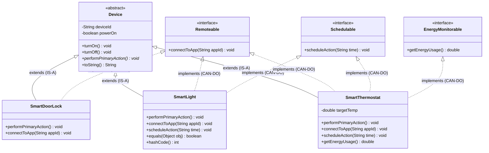
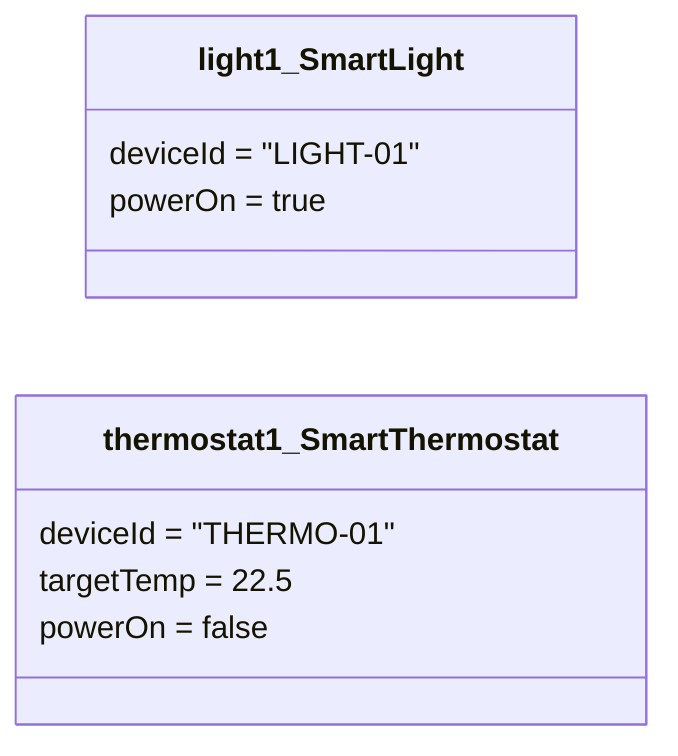
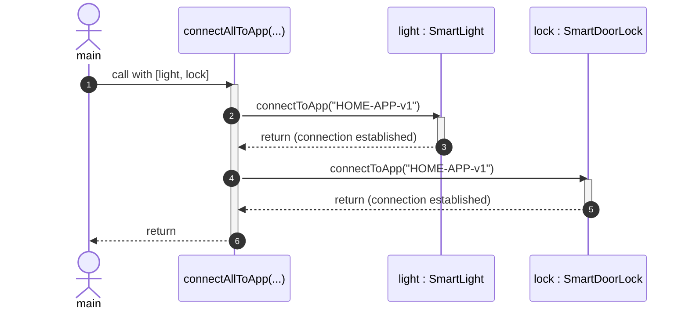

# UML Diagrams & Architectural Modeling

This document provides formal UML diagrams and architectural notes based on **Section 6** of `STEP-SEM-3_Week_8_Category_B_ObjectMethods_InnerClasses_UML_Concept_Intro`.

---

## 1. UML Class Diagram (Structure Overview)

The class diagram describes the static structure of the Smart Home ecosystem: abstract classes, concrete subclasses, and capability interfaces.

### UML Notation Rules:
- **Generalization (`extends`)**: Represented by a solid line with a hollow closed triangle pointing to the superclass (`Device`).
- **Realization (`implements`)**: Represented by a dashed line with a hollow closed triangle pointing to the interface (`Remoteable`, `Schedulable`, `EnergyMonitorable`).
- **Abstract Methods**: Written in italics (or marked with `*` / `{abstract}`) matching Java's `abstract` keyword.

---

## 2. UML Object Diagram (Runtime Snapshot)

The object diagram captures a single frozen moment in time during program execution, showing specific allocated instances with their concrete state.

### Visual Characteristics:
- Headings are formatted as **`<u>objectName : ClassName</u>`** (underlined).
- Contains actual field values (e.g. `"LIGHT-01"`, `22.5`), never abstract method signatures.

---

## 3. UML Sequence Diagram (Method Interaction Over Time)

The sequence diagram illustrates how objects collaborate chronologically to achieve a workflow (`connectAllToApp`). Time flows vertically downwards.

### Key Observation:
Because Java loops are synchronous and single-threaded by default, `light.connectToApp()` must completely finish execution and return before `lock.connectToApp()` can begin.

---

## 4. Comparison of the Three UML Views

| Diagram | Shows | Never Contains |
| :--- | :--- | :--- |
| **Class Diagram** | Types, fields, methods, inheritance (`extends`), and interface contracts (`implements`). | Actual field values or specific object instance names. |
| **Object Diagram** | One frozen instant of specific running objects and their actual runtime field values. | Method bodies or uninstantiated class relationships. |
| **Sequence Diagram** | Chronological order of method calls and returns across object lifelines for a specific scenario. | Internal structure of classes or persistent field states. |
